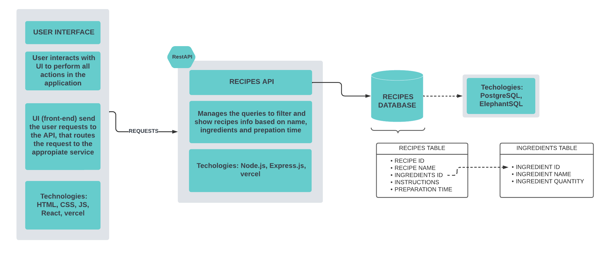

# Recipe Application

This is a recipe application that allows users to browse and filter recipes based on ingredients, preparation time, and name. The application provides an interactive user interface to help users find and explore various recipes.

## Diagrams

## Technologies Stack

- Front-End: React, HTML, CSS
- Back-End: Express.js, Vercel
- Databsae: PostgreSQL, ElephantSQL

Inside each directory, there are more details and information on how the project was developed and how to use the tools.

The application is available on:

## Usage

To run the application locally:

1. Clone this repository.
2. Navigate to the project directory
   2.a. If you want to run the frontend or backend, go to the desired directory and

   - Install dependencies using `npm install`.
   - Run the application using `npm start`.

     2.b. If you want to run the data servieces, go to the data directory and

   - `python -m venv venv`
   - `venv/Scripts/activate`
   - `pip install -r requirements.txt`
   - `Use the notebook`

3. Remeber to create dotenv files with sensitive information;

4. More detailed tutorials inside each directory!

## License

This project is licensed under the MIT License. See the [LICENSE](LICENSE) file for details.
